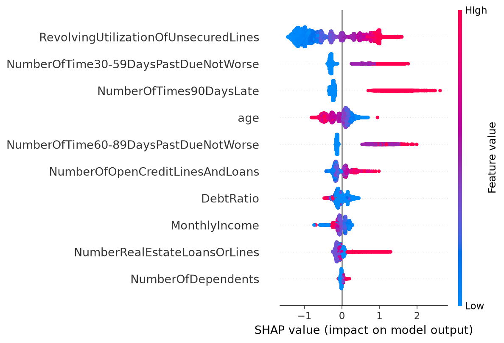

# 🛡️ CreditShield

Predicts the probability of 2-year serious credit delinquency for loan applicants.  
End-to-end MLOps: train → track → explain → serve → containerise → test → monitor → deploy.

**Stack:** scikit-learn · XGBoost · LightGBM · Optuna · SHAP · MLflow · FastAPI · Docker · pytest · GitHub Actions · Evidently · Streamlit

---

## Results

| Model | ROC-AUC | Notes |
|---|---|---|
| Logistic regression (baseline) | 0.8000 | class_weight="balanced" |
| XGBoost | 0.8668 | scale_pos_weight=14 |
| LightGBM | 0.8674 | is_unbalance=True |
| XGBoost + SMOTE | 0.8386 | imbalanced-learn oversampling |
| **XGBoost + Optuna (best)** | **0.8699** | deployed model |

---

## SHAP — top default drivers



`RevolvingUtilizationOfUnsecuredLines` and `NumberOfTimes90DaysLate` dominate:
being maxed out on credit and having recent serious delinquency are the
strongest predictors of default.

---

## Architecture decisions

**Why scale_pos_weight / is_unbalance?**  
The dataset is ~6.7% positive. A naive model predicting "no default" achieves 93% accuracy but zero recall on defaults. Class weighting penalises missed defaults proportionally to the imbalance.

**Why isotonic calibration?**  
Raw XGBoost probabilities are overconfident. For credit decisions the actual probability matters — "80%" should mean default happens 80% of the time. Isotonic calibration corrects this.

**Why Optuna over GridSearchCV?**  
Optuna uses TPE (Tree-structured Parzen Estimation), a Bayesian method that focuses trials on promising regions. 30 Optuna trials find better parameters than a 100-point grid search.

**Why SMOTE as a separate run?**  
Oversampling and class-weighting are different strategies for the same problem. Running both in MLflow lets me compare empirically rather than assume one is better.

---

## Run locally

```bash
git clone https://github.com/ishanbajwa07/CreditShield
cd CreditShield
python -m venv venv && source venv/bin/activate
pip install -r requirements.txt
# drop cs-training.csv into data/raw/ first
python -m src.train
python -m src.explain
uvicorn api.main:app --reload
```

## Run with Docker

```bash
docker build -t creditshield .
docker run -p 8000:8000 creditshield
curl http://localhost:8000/health
```

## Run Streamlit demo

```bash
streamlit run app/streamlit_app.py
```

---

## What I'd add next

- Retraining trigger when Evidently flags drift
- A /batch endpoint for scoring multiple applicants at once
- Model performance monitoring (not just data drift)